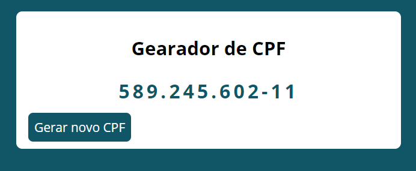

# gerador_de_cpf
Esse projeto utiliza JavaScript e Webpack  para criar um gerador de CPF.

## Minha aplicação:

## Sobre a aplicação:

Esse sistema sintetiza um número de CPF completo a partir de números aleatórios realizando as operações matemáticas 
na geração dos dois últimos algarismos. O conceito de Webpack traz para o projeto uma maior acessibilidade para navegadores mais antigos, 
como por exemplo o internet explorer, além de ser modularizado em suas funcionalidades, o que o torna mais organizado.  

## Por que essa aplicação?

Esse sistema foi criado para prática da lógica de programação e do conceito de webpack, além de 
acrescentar em meu portfólio pessoal. 

## Ficaria feliz em receber feedBacks:

E-mail: raphaeldesousalm@gmal.com  
Linkdin: https://www.linkedin.com/in/raphaellima98/
